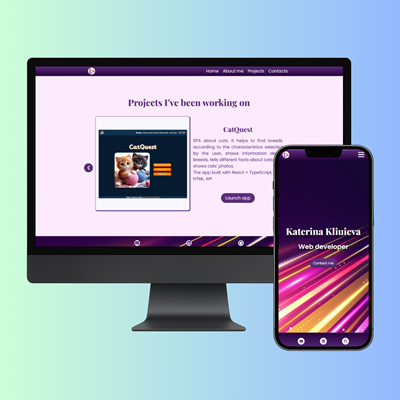

# 🎨 Katerina Kliuieva — Portfolio SPA

Live site → https://portfolio-katerina.netlify.app/

A responsive single‑page portfolio built with **vanilla JavaScript, HTML & CSS**.  
Smooth section navigation, custom project slider, burger menu for mobile and a clean contact section.

## Key Features

-  One‑page layout with animated scroll
-  3×3 custom slider showcasing projects
-  Burger navigation under 768 px
-  Fully responsive (mobile → 4K)
-  Deployed on Netlify CI/CD

## Tech Stack

HTML | CSS | JavaScript (ES6) · Font Awesome · Netlify deploy
